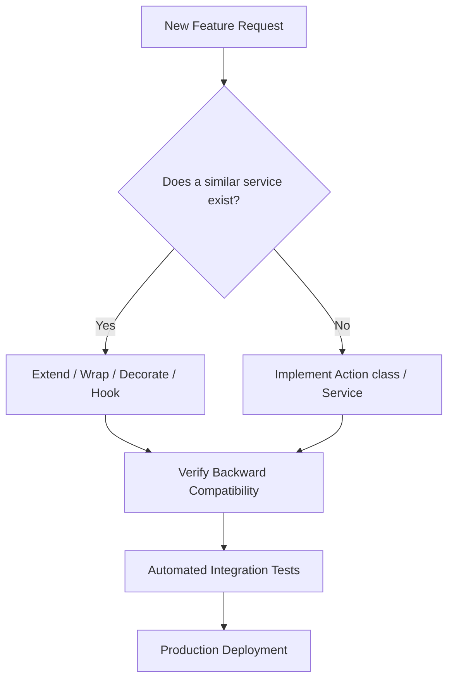

# AI Development Guide: The Khidmah Pro ERP Constitution

This document serves as the mandatory development guide and constitution for every AI assistant, agent, and engineer working on the **Khidmah Pro ERP Platform** (codebase: **Carag V2**). It outlines the design principles, architectural constraints, security rules, and development workflows that must be strictly followed to ensure stability, scalability, and quality.

---

## 1. Project Philosophy

Khidmah Pro is a mature, operational, enterprise-grade ERP platform serving active automotive service centers, repair shops, and vehicle fleets. 

* **It is NOT a demo.**
* **It is NOT an MVP.**
* **It is NOT a prototype.**

Every feature, integration, migration, or interface modification must be designed and implemented to be **production-ready**, highly performant, secure, and backward-compatible. Refactoring stable components or introducing untested abstractions is strictly forbidden unless authorized. Extension of the existing core is the primary development path.

---

## 2. Development Principles

All software design and implementation on the platform must adhere to the following principles:

| Principle | Description | Implementation in Khidmah Pro |
| :--- | :--- | :--- |
| **Backward Compatibility First** | Existing databases, APIs, routes, and user configurations must never be broken by new updates. | Schema updates must preserve old data. API updates must use versioning. |
| **Extension Before Modification** | Avoid modifying stable core classes. Extend behavior via sub-classing, interfaces, decorators, and events. | Use Laravel Observers, Event Listeners, or extend Action classes. |
| **Reuse Before Creation** | Analyze the codebase to identify existing helper classes, utilities, models, and UI components before creating new ones. | Utilize existing Vue components (e.g. `SaudiPlateInput`, `SignaturePad`) and models. |
| **Clean Architecture** | Keep layers separated. Logic should not leak across boundaries. | Separate Database (Eloquent), Logic (Services/Actions), and Web/Transport (Controllers/Inertia). |
| **SOLID Principles** | Adhere to Single Responsibility, Open-Closed, Liskov Substitution, Interface Segregation, and Dependency Inversion. | Controllers handle requests, Services handle business logic, Policies handle authorization. |
| **DRY (Don't Repeat Yourself)** | Business logic, calculations, and rules must be written once and shared. | Share tax calculations in `TaxCalculator`, and state changes in composables. |
| **KISS (Keep It Simple, Silly)** | Write clear, readable, and direct code. Avoid over-engineering and premature optimization. | Use standard Eloquent relationships and Laravel conventions. |
| **Single Source of Truth** | Key states, options, configuration keys, and translations must be defined in one central location. | Use `app/Support/Permissions.php` for permissions, and `ar.json`/`en.json` for UI labels. |
| **API First** | Design logic inside Services and Actions so it can be exposed through Inertia web views, REST APIs, or queue jobs. | Business actions return models/arrays, which can be formatted differently. |
| **Domain-Driven Design (DDD)** | Group code logically by functional domains. | Domains are structured in both frontend (Folders) and backend (Models/Controllers). |
| **Event-Driven Integration** | Keep modules loosely coupled. Trigger events for side effects instead of hardcoding cross-domain logic. | Use model observers (`InvoiceObserver`, `CenterObserver`) to sync states. |

---

## 3. Existing System Rules

Before starting any task, you must search and analyze the existing codebase. **Do NOT reinvent the wheel.** You are forbidden from creating new entities without verifying if one exists in the project:

* **Database Tables**: Check the existing migrations in `database/migrations/` and model definitions.
* **Controllers**: Check `app/Http/Controllers/App/` and `app/Http/Controllers/System/`.
* **Repositories / Actions**: Locate services in `app/Services/` and custom actions in `app/Actions/`.
* **Services**: Inspect `InventoryService`, `InvoiceService`, `PaymentManager`, `AttendanceCalculationService`, and `SmtpConfigService`.
* **Components**: Look under `resources/js/Components/` for forms, selects, prints, or tables.
* **Layouts**: Use `AppLayout.vue`, `GuestLayout.vue`, `SystemLayout.vue`, and `EmployeePortalLayout.vue`.
* **Routes**: Inspect `routes/web.php`, `routes/api.php`, and `routes/auth.php`.
* **Permissions**: Check Spatie permission mappings in `app/Support/Permissions.php`.
* **Settings**: Inspect `TenantTaxSetting`, `TenantZatcaSetting`, `PaymentSettings`, and the global `Setting` model.
* **Events & Notifications**: Look in `app/Notifications/`, `app/Mail/`, and console tasks in `app/Console/Commands/`.

---

## 4. Existing Code Inspection Checklist

Before executing any task, inspect the following architectural layers to understand the current implementation context:

1. **Tenant Isolation System**: Review how `TenantScoped` and `CenterScoped` traits dynamically enforce data segregation.
2. **Current Project Structure**: Identify target modules (CRM, Purchasing, Inventory, HR, Finance, Subscriptions, Platform).
3. **Database Schema**: Check columns, foreign keys, nullable states, and relationships in the target models.
4. **Service Layers**: Verify if the business logic belongs to `InventoryService`, `InvoiceService`, or `PaymentManager`.
5. **Console Commands & Schedulers**: Check `app/Console/Commands/` to see how cron jobs (like subscription renewals) are executed.
6. **Authorization Policies**: Map Laravel policy files (`app/Policies/`) with permissions in `Permissions.php`.
7. **Routing & Middleware**: Check where the route belongs. Is it under tenant check (`EnsureTenantActive`), branch context (`EnsureCenterContext`), or 2FA challenge (`EnsureTwoFactorEnabled`)?
8. **Reusable Components**: Inspect components under `resources/js/Components/` (e.g. `SaudiPlateDisplay`, `SaudiPlateInput`, `SignaturePad`, `CustomDatePicker`, `SearchableSelect`).
9. **Internal/External APIs**: Inspect biometric clock-in endpoints (`routes/api.php`) and autocomplete lookups (`routes/web.php`).
10. **Storage & Disk Configuration**: Review filesystem setup (`config/filesystems.php`) and public path mappings.
11. **Caching & Queues**: Verify caching keys, prefix constraints, and database-backed queues.
12. **Logging**: Review Stack logging channels and how error flows are tracked.

---

## 5. Integration Rules

When integrating new features or extending modules, you must keep the core stable by using non-invasive patterns:



* **Extend**: Add relationships, attributes (using Eloquent accessors), or class inheritance.
* **Wrap / Decorate**: Use manager patterns (e.g., `PaymentManager` wrapping gateways like Moyasar, Tap, Tamara).
* **Hook / Observe**: Use Eloquent events (`creating`, `updating`) or dedicated observers (`InvoiceObserver`) to run side-effects.
* **Event Listening**: Utilize events or queues to decoupled cross-module actions.
* **Composition**: Combine small, testable actions (e.g., `MergeCustomerAction`) to form workflows.
* **DO NOT** delete stable code, rewrite database query wrappers, or replace existing layout files without approval.

---

## 6. Multi-Tenant Rules

Khidmah Pro uses a single shared database partitioned by `tenant_id` (Logical Isolation). Strict adherence to tenant boundaries is mandatory:

1. **Tenant Scope**: Models containing tenant-specific data must use the `App\Models\Concerns\TenantScoped` trait.
2. **Center Scope**: Models containing branch-specific data must use the `App\Models\Concerns\CenterScoped` trait.
3. **Implicit Insertion**: Do not manually assign `tenant_id` or `center_id` on model creation if the traits are booted. They will be auto-filled from `TenancyContext`.
4. **File Uploads**: Files uploaded by a tenant must be saved in isolated paths: `storage/app/public/tenants/{tenant_id}/{center_id}/{domain}/`.
5. **Internal/External Notifications**: Notifications must target user groups belonging strictly to the tenant's context.
6. **Cache Keys**: Tenant cache keys must be isolated using the pattern: `tenant:{tenant_id}:center:{center_id}:{key}`.
7. **Queues**: Queue jobs must carry and restore the tenant context (e.g., tenant ID and center ID) upon execution.

---

## 7. Database Rules

* **Table Names**: Must be plural and use snake_case (e.g. `work_orders`, `purchase_invoice_lines`).
* **Model Names**: Must be singular and use PascalCase (e.g. `WorkOrder`, `PurchaseInvoiceLine`).
* **Foreign Keys**: Must follow the convention: `singular_table_name_id` (e.g. `customer_id`, `supplier_id`).
* **Tenant Safety**: Every tenant-level table must include:
  ```php
  $table->foreignId('tenant_id')->constrained()->cascadeOnDelete();
  $table->foreignId('center_id')->nullable()->constrained()->nullOnDelete();
  ```
* **Destructive Actions Prohibited**: Never drop tables, remove production columns, or rename tables without a safe migration strategy that preserves historical records.
* **Soft Deletes**: Always use `$table->softDeletes()` and the `SoftDeletes` trait on core business models (Customers, Vehicles, Work Orders, Invoices, Parts, Suppliers, Employees).
* **Indexes**: Add database indexes to frequently queried columns (such as `status`, `sku`, `phone`, `date`).

---

## 8. API Rules

* **Versioning**: All public or external integrations must expose versioned endpoints under `/api/v1/`.
* **REST Conventions**:
  * `GET` for fetching data (must be stateless and safe).
  * `POST` for creating resources.
  * `PUT/PATCH` for updates.
  * `DELETE` for soft/hard deletion.
* **Return Formats**: APIs must return standardized JSON payloads with HTTP status codes:
  * `200 OK` / `201 Created`
  * `400 Bad Request` (Invalid input payload)
  * `401 Unauthenticated` (Missing token)
  * `403 Unauthorized` (Permission denied)
  * `404 Not Found` (Resource missing)
  * `422 Unprocessable Entity` (Form validation failure)
* **Autocomplete & Search Lookups**: Separate fast autocomplete APIs from main page queries to reduce network payload.

---

## 9. Frontend Rules

* **Vue 3 Composition API**: Only use the `<script setup>` syntax. Options API is strictly prohibited.
* **Layout Reuse**: Embed components in the correct structural layout (`AppLayout.vue`, `GuestLayout.vue`, `SystemLayout.vue`, `EmployeePortalLayout.vue`).
* **Do NOT Duplicate Pages**: If a page changes slightly for a different role, use tabs, conditional rendering, or sub-components.
* **Saudi Plate Input & Display**: Always use `SaudiPlateInput.vue` and `SaudiPlateDisplay.vue` when capturing or displaying plate numbers.
* **Mobile-First Layouts**: Ensure grid wrappers, table wraps (`overflow-x-auto`), and buttons are fully responsive (`w-full md:w-auto`).
* **No Inline styling**: Styles must rely on Tailwind CSS classes. No inline styles.

---

## 10. UI Standards

Maintain a premium visual identity across the ERP:

* **Color Codes (Module Identity)**:
  * CRM & Customers: Cyan (`cyan-600`)
  * Vehicles: Blue (`blue-600`)
  * Work Orders: Indigo (`indigo-600`)
  * Invoices & Payments: Emerald / Green (`emerald-600`)
  * Quotes: Amber / Orange (`amber-500`)
  * Settings: Gray (`gray-700`)
* **Typography**: Use high-quality web typography (`Tajawal` / `Inter` / `Noto Kufi Arabic`). Avoid browser defaults.
* **Spacing**: Use standard padding/margin spacing scales (e.g. `p-4 sm:p-6`, `space-y-6`).
* **Cards & Forms**: Content containers must use `rounded-2xl` or `rounded-3xl` with thin borders (`border-gray-200 dark:border-gray-700`) and soft shadows. Input fields must use `bg-gray-50 dark:bg-gray-900` with `rounded-xl`.
* **Dark Mode**: Add `dark:` variant classes to every structural div, text, input, and border to support dual themes.
* **RTL & LTR Translation**: Do not use absolute positioning classes like `left-0`. Use logical CSS classes like `start-0`, `end-0`, `rtl:rotate-180` (for direction arrows) to ensure Arabic/English rendering is flawless.
* **i18n Translation**: No hardcoded text inside Vue templates. Always use `$t('key.name')` mapping to `ar.json` and `en.json`.

---

## 11. Performance Rules

* **Prevent N+1 Queries**: Always eager-load relations in Eloquent queries using `with([...])` before paginating or returning data.
* **Eager Loading Constraints**: Avoid loading huge relationships (e.g., a customer's entire invoice history) if only a name or count is required. Use `withCount()` or specific select fields.
* **Pagination**: Lists must always be paginated (e.g. `paginate(15)`). High-density indexes must use cursor pagination or lazy scrolling.
* **Caching**: Cache static system configurations, translations, and catalog lists. Bust cache whenever updates occur.
* **Queued Tasks**: Heavy processing (such as generating PDF invoices, syncing payments, or dispatching multi-channel emails) must be executed in background queues.

---

## 12. Security Rules

* **OWASP Top 10**: Write code resilient to SQL Injection, XSS, CSRF, and broken access control.
* **Form Validation**: Validate all incoming parameters inside Form Requests (`ModelStoreRequest`) with strict validation rules. Never trust input variables.
* **Request Authorization**: Check policies on every controller endpoint using `$this->authorize('view/create/update/delete', $model)`.
* **Public Links Protection**: Publicly accessible links (such as quotes for client approval) must use secure, unguessable UUIDs rather than database incrementing IDs.
* **2FA Enforcement**: Enforce multi-factor checks on administrative actions and settings modifications.
* **Data Encryption**: Encrypt API credentials, tokens, and sensitive integration settings at rest.

---

## 13. Feature Development Workflow

When implementing or extending any feature, you must strictly follow this 9-step development cycle:

1. **Inspect Architecture**: Understand the system design for the feature scope.
2. **Inspect Existing Code**: Search the database migrations, routes, policies, and Vue files.
3. **Identify Reusable Code**: Find actions, composables, helpers, or layout modules to leverage.
4. **Detect Potential Conflicts**: Ensure the changes do not break backward compatibility or scope boundaries.
5. **Define Integration Strategy**: Decide whether to wrap, listen, extend, or subclass.
6. **Request Feedback**: Stop and get explicit user approval if any breaking change is detected.
7. **Implement Safely**: Write clean, DRY code matching existing patterns.
8. **Run Tests**: Verify using unit/feature tests and perform manual UI verification.
9. **Write Walkthrough**: Record and document the changes in a walkthrough artifact.

---

## 14. Mandatory Integration Report

Before writing any backend or frontend code, the AI assistant **MUST** generate an Integration Report and present it to the user. Use the following structured format:

```markdown
# Integration Report: [Feature Name]

## 1. Existing Components & Services
* List any existing models, services, actions, or views relevant to this feature.

## 2. Affected Modules & APIs
* Identify which modules and APIs will be extended or modified.

## 3. Database Changes
* Outline table modifications, new tables, columns, or indexes (with rollback safety verified).

## 4. UI/UX & Style Impact
* Identify components, pages, or layout files that will render this feature.

## 5. Security & Isolation Impact
* Verify policies, permissions, and multi-tenant scoping traits applied.

## 6. Risk Level & Breaking Changes
* Rate the risk (Low/Medium/High). List any potential backward compatibility risks.

## 7. Detailed Implementation Strategy
* Step-by-step plan of code changes (Dependencies first, then Models, Services, Controllers, and UI).
```

---

## 15. Forbidden Actions

The following actions are **STRICTLY FORBIDDEN**:

* **DO NOT** delete stable, functioning code blocks to write "cleaner" versions unless refactoring is requested.
* **DO NOT** rewrite or duplicate existing functional modules (e.g. creating a custom invoice engine when `InvoiceService` is available).
* **DO NOT** bypass multi-tenant traits (`TenantScoped` / `CenterScoped`) in raw queries.
* **DO NOT** bypass Spatie role/permission check in templates or controller actions.
* **DO NOT** write temporary fixes, hacks, or bypass validation rules.
* **DO NOT** hardcode Arabic/English text in front-end pages or backend responses (always use translation files).
* **DO NOT** release a feature without automated testing or manual verification.

---

## 16. Required Quality Gates

Every feature contribution must pass the following quality checkpoints:

1. **Architecture Gate**: Verify the codebase organization is respected (Service/Action separation, no Repository pattern pollution).
2. **Code Quality Gate**: Code must be readable, typed, clean (no commented blocks), and DRY.
3. **Security Gate**: Validate inputs, authorize requests via policies, verify tenant isolation, and check 2FA.
4. **Performance Gate**: Verify eager loading is applied, check database queries count, and ensure correct indexing.
5. **Accessibility (a11y) Gate**: Ensure HTML tags are semantic, buttons have labels, images have alt tags, and contrast is sufficient.
6. **API Gate**: Ensure REST routes are structured, versioned, and return consistent formats.
7. **Database Gate**: Validate migrations are safe, columns are not removed, and soft deletes are active.
8. **Tenant Isolation Gate**: Run assertions ensuring one tenant cannot view or modify another's data.
9. **Testing Gate**: Write feature tests covering new logic paths, ensuring all assertions pass cleanly.

---

## 17. Definition of Done (DoD)

A development task is considered complete **ONLY** when the following criteria are met:

* **Architectural Alignment**: The code matches the platform design and conventions.
* **No Code Duplication**: Extracted reusable functions, composables, and components.
* **No Database Duplication**: Reused existing tables and relationships.
* **No API Duplication**: Shared endpoints and services.
* **All Tests Passed**: Automated feature/unit tests run and pass without errors.
* **Zero Breaking Changes**: Fully backward-compatible with no regressions.
* **Fully Documented**: Updated modal references, workflows, and walkthrough logs.
* **Production-Ready**: The feature is robust, fully localized (Arabic/English), responsive, and tested.
